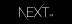
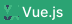
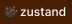
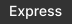

## 프로젝트
<h4>[Javascript] 다온펜션의 리뉴얼 프로젝트 입니다.</h4>
<a href="https://github.com/qodql/daon">😺깃허브</a> <a href="https://qodql.github.io/daon/index.html">⚡사이트</a> 

<h4>[Next.js] 도서 리뷰 애플리케이션 책이음 입니다.</h4>
<a href="https://github.com/qodql/ieum-ykb">😺깃허브</a> <a href="https://ieum-ykb.vercel.app/">⚡사이트</a> 

<h4>[React] 영화 소개 웹 애플리케이션 피커 입니다.</h4>
<a href="https://github.com/qodql/picker">😺깃허브</a> <a href="https://picker-ykb.vercel.app/">⚡사이트</a> 

<h4>[Vue.js] 뉴스 애플리케이션 엔뉴스 입니다.</h4>
<a href="https://github.com/qodql/news">😺깃허브</a> <a href="https://nnews-ykb.vercel.app/">⚡사이트</a>

## 사용 기술

<h4>프레임워크</h4>

<h4>라이브러리</h4>

<h4>백엔드</h4>

<h4>툴</h4>

